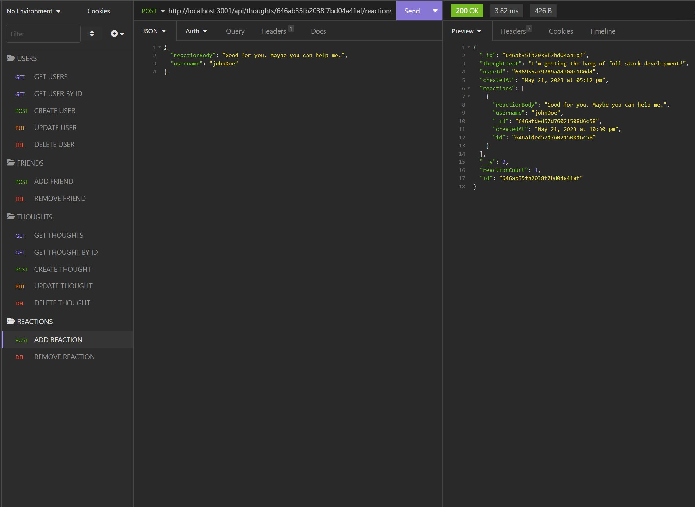

# Social Network API
  

  ## Description
  This application is a back-end environement for a social media site. The purpose of this application was to utilize newly learned MongoDB and Mongoose techniques. The application is not a fully functioning standalone app. It is an API that can be tested through Insomnia or any similar applications. This API is set up for viewing, creating, updating and deleting users. Friends can be added or removed from users. Thoughts, or posts, can be created, updated, and deleted. Reactions to the posts can be created and deleted. Overall, this is an API that offers many back-end functions of a simple social media site.

  Technologies used: MongoDB, Mongoose, Express.js, Node.js

  ## Table of Contents
  * [Installation](#installation)
  * [Usage](#usage)
  * [License](#license)
  * [Credits](#credits)

  ## Installation
  To install dependencies, use the command `npm i`.
  
  ## Usage
  To start this application, run the command `npm start`. To test the API, use Insomnia or a similar application. The routes are as follows:

**User Routes** 
`GET /api/users`: Get all users. 
`GET /api/users/:userId`: Get a single user by id. 
`POST /api/users`: Create a new user. Requires a JSON body with username and email. 
`PUT /api/users/:userId`: Update a user by id. Requires a JSON body with at least one of the following: username or email. 
`DELETE /api/users/:userId`: Delete a user by id. 
`POST /api/users/:userId/friends/:friendId`: Add a friend to a user's friend list. 
`DELETE /api/users/:userId/friends/:friendId`: Remove a friend from a user's friend list.  
**Thought Routes** 
`GET /api/thoughts`: Get all thoughts. 
`GET /api/thoughts/:thoughtId`: Get a single thought by id. 
`POST /api/thoughts`: Create a new thought. Requires a JSON body with thoughtText and userId. 
`PUT /api/thoughts/:thoughtId`: Update a thought by id. Requires a JSON body with thoughtText. 
`DELETE /api/thoughts/:thoughtId`: Delete a thought by id. 
`POST /api/thoughts/:thoughtId/reactions`: Add a reaction to a thought. Requires a JSON body with reactionBody and username. 
`DELETE /api/thoughts/:thoughtId/reactions/:reactionId`: Remove a reaction from a thought. 

Walkthough Video: https://drive.google.com/file/d/1XMXaBsQFI5BqZKEvbS493oTGe6wf74Ah/view

## License

This project is licensed under the [MIT](https://opensource.org/licenses/MIT) license.

## Credits

https://www.mongodb.com/docs/ 
https://mongoosejs.com/docs/ 
https://expressjs.com/ 
https://nodejs.org/en/ 
https://www.npmjs.com/package/express 
https://www.npmjs.com/package/mongoose 
https://www.npmjs.com/package/moment 
